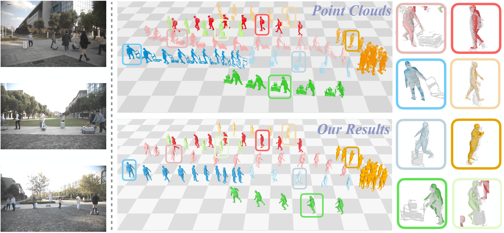

  <h1 align="center">LiveHPS++: Robust and Coherent Motion Capture in Dynamic Free Environment</h1>
  <h3 align="center"><a href="https://arxiv.org/abs/2407.09833">Paper</a> | <a>Video</a> | <a href="https://drive.google.com/file/d/1qWxZzYqeMApy2ZEYA4894Y-rQA6znn7d/view">Dataset</a> | <a href="https://4dvlab.github.io/project_page/LiveHPS2.html">Project Page</a></h3>

*The source code of our work "LiveHPS++: Robust and Coherent Motion Capture in Dynamic Free Environment", accepted to ECCV 2024 Oral*

  

## NoiseMotion Usage

### Prepare SURREAL Dataset and NoiseMotion Dataset
NoiseMotion is generated based on the SURREAL and ShapeNet, while SUUREAL provides the ground truth SMPL Parameters and ShapeNet provides the noise objects. The dataloader of NoiseMotion can refer to `Dataloader_NoiseMotion.py`

